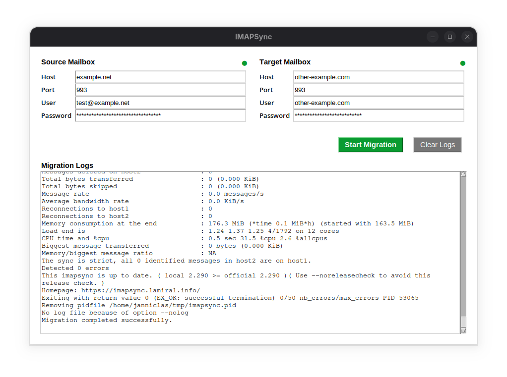

## IMAPSync GUI

I constantly need to migrate email inboxes between servers - a tedious task. I struggled to find a free and satisfactory 
solution which could save stress and time.

That's when I discovered the reliable [Imapsync](https://github.com/imapsync/imapsync) console tool. Still, I missed 
the convenience of a visual interface. This is why I developed this minimalistic user interface that allows you to 
transfer IMAP folders with a few clicks and graphical feedback.



## Requirements

Requires Python 3.8 or higher and the Imapsync command-line tool installed and available in your PATH.

## Using the Script

To launch the GUI in development mode, run:

```bash
python main.py [lang]
```

The optional `lang` parameter loads translations from the `/locales` directory (currently `en` and `de`). New
languages can be added simply by dropping further translation files into `/locales`.

## Using the Binaries

Alternatively, you can use the pre-compiled executables located in the `./bin` directory. These binaries are 
self-contained and do not require a Python installation to run.

```bash
# For Linux:
./ImapSync-GUI [lang]

# For Windows:
.\ImapSync-GUI.exe [lang]
```